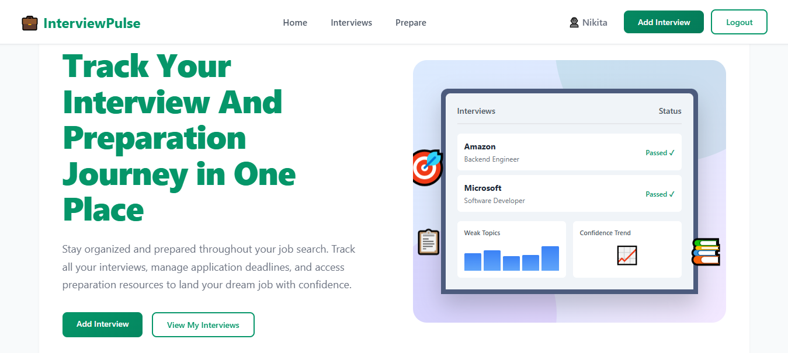

# 💼 InterviewPulse

**Track Your Interview And Preparation Journey in One Place**



## Overview

InterviewPulse is a comprehensive Django-based web application designed to help job seekers stay organized throughout their job search journey. Track all your interviews, manage application deadlines, and access preparation resources to land your dream job with confidence.

## ✨ Features

- **Interview Tracking**: Keep detailed records of all your interviews including company names, positions, dates, and outcomes
- **Status Management**: Track interview progress with status indicators (Scheduled, Passed, Failed, Pending)
- **Preparation Resources**: Access categorized preparation materials and tips
- **User Authentication**: Secure login and profile management
- **Responsive Design**: Modern, animated UI with a clean teal/green color scheme
- **Dashboard Analytics**: Visual representation of your interview journey

## 🚀 Getting Started

### Prerequisites

- Python 3.8+
- Django 6.0

### Installation

1. **Clone the repository**
   ```bash
   git clone <repository-url>
   cd InterviewPulse/INTERVIEW_PULSE
   ```

2. **Create and activate virtual environment**
   ```bash
   python -m venv venv
   venv\Scripts\activate  # Windows
   # or
   source venv/bin/activate  # Mac/Linux
   ```

3. **Install dependencies**
   ```bash
   pip install -r requirements.txt
   ```

4. **Run migrations**
   ```bash
   cd interview_pulse
   python manage.py migrate
   ```

5. **Create a superuser (optional)**
   ```bash
   python manage.py createsuperuser
   ```

6. **Run the development server**
   ```bash
   python manage.py runserver
   ```

7. **Access the application**
   
   Open your browser and navigate to `http://127.0.0.1:8000/`

## 📁 Project Structure

```
INTERVIEW_PULSE/
├── assets/                     # Images and media files
├── interview_pulse/
│   ├── interview_pulse/       # Main project settings
│   │   ├── settings.py
│   │   ├── urls.py
│   │   └── wsgi.py
│   ├── interviews/            # Interview tracking app
│   │   ├── models.py
│   │   ├── views.py
│   │   └── templates/
│   ├── preparation/           # Preparation resources app
│   │   ├── models.py
│   │   ├── views.py
│   │   └── templates/
│   ├── users/                 # User authentication app
│   │   ├── models.py
│   │   ├── views.py
│   │   └── templates/
│   ├── static/                # CSS, JS, and static files
│   │   └── css/
│   ├── templates/             # Base templates
│   └── manage.py
├── requirements.txt
└── README.md
```

## 🎨 Design Features

- **Modern UI**: Clean, professional design with smooth animations
- **Color Scheme**: Teal/green primary colors (#059669) for a fresh, professional look
- **Animations**: Comprehensive CSS animations including:
  - Page load transitions
  - Staggered card appearances
  - Hover effects and transforms
  - Infinite pulse and gradient effects
- **Responsive Layout**: Built with CSS Grid and Flexbox

## 🛠️ Technology Stack

- **Backend**: Django 6.0
- **Frontend**: HTML5, CSS3 (Pure CSS animations, no JavaScript frameworks)
- **Database**: SQLite (default, easily configurable for PostgreSQL/MySQL)
- **Font**: Inter font family

## 📝 Usage

1. **Register/Login**: Create an account or log in to access your dashboard
2. **Add Interviews**: Click "Add Interview" to log new interview details
3. **Track Progress**: View all your interviews with status indicators
4. **Prepare**: Access preparation resources categorized by topic
5. **Manage Profile**: Update your profile information and preferences

## 🤝 Contributing

Contributions are welcome! Feel free to submit issues and pull requests.

## 📄 License

This project is open source and available under the MIT License.

## 👨‍💻 Author

Built with ❤️ for job seekers everywhere

---

**Stay organized. Stay prepared. Land your dream job.** 🚀
